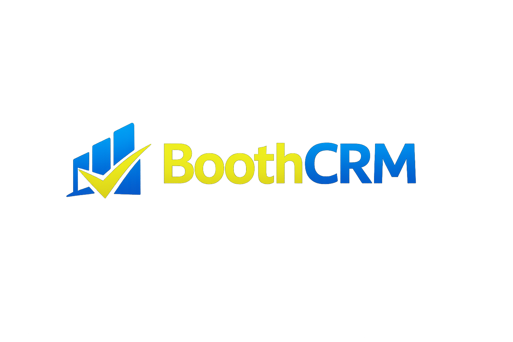
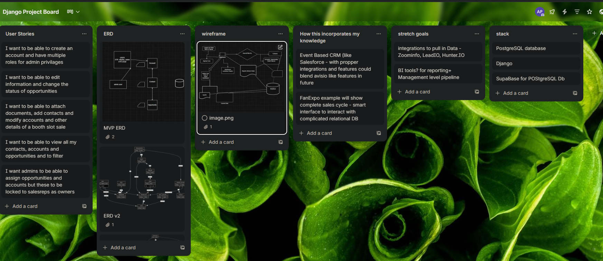

# BoothCRM

## Logo

---

## Description
**BoothCRM** is a lightweight CRM designed to track company accounts and their relationship status.  
Users can categorize organizations as **Customers**, **Prospects**, or **Inactive Accounts**, while storing key account information for simple management and visibility.

The goal of BoothCRM is to provide a **clean, minimal CRM-style tool** for managing account relationships without the complexity of large enterprise systems.

---

## Getting Started

**Deployed App:**  
https://boothcrm-9de37e80aa44.herokuapp.com/

**Planning Materials:**  

Basic workflow:
1. Add a company account
2. Assign its relationship status (Customer, Prospect, Inactive)
3. Update or manage records as account status changes

Trello Board

**Demo Accounts:**

| Username | Password | Role |
|---|---|---|
| demo_manager | demo1234 | Manager |
| sarah_rep | demo1234 | Sales Rep |
| kenji_rep | demo1234 | Sales Rep |

**Planning Materials:**  
- ERD and wireframes designed prior to development
- Data models: Account, Contact, Opportunity, Event, ActivityLog, Tag
---

## Technologies Used

- **Python 3.11**
- **Django 5.2** — web framework
- **PostgreSQL** — relational database
- **psycopg2-binary** — PostgreSQL adapter
- **Whitenoise** — static file serving in production
- **Gunicorn** — production WSGI server
- **dj-database-url** — Heroku database URL parsing
- **python-dotenv** — environment variable management
- **Pillow** — image handling
- **django-extensions** — development utilities
- **HTML / CSS** — custom dark theme UI (no framework)
- **Heroku** — deployment platform

## Features

- Public browsing of accounts, contacts, opportunities, and events — no login required
- Session-based authentication with role-based dashboards (admin, manager, sales rep)
- Full CRUD for all four data entities
- Activity log tracking field-level changes on key models
- Pipeline forecasting and overdue follow-up tracking on the dashboard
- Event capacity tracking across vendor, guest, signing, panel, and custom room types
- Superuser-only delete with confirmation dialog

## Attributions

- Icons from https://heroicons.com  
- UI inspiration from modern CRM dashboards (Salesforce, HubSpot)
- General Assembly Sessions, lessions and course notes
- ChatGPt, Claude Sonnet, Opus,  Haiku for code planning, duplication and troubleshooting

## Next Steps

Future improvements planned for BoothCRM:

- Email notifications for overdue follow-ups
- CSV export for accounts and opportunities
- Kanban board view for opportunity pipeline
- Calendar view for upcoming events
- Notes/comments system per record